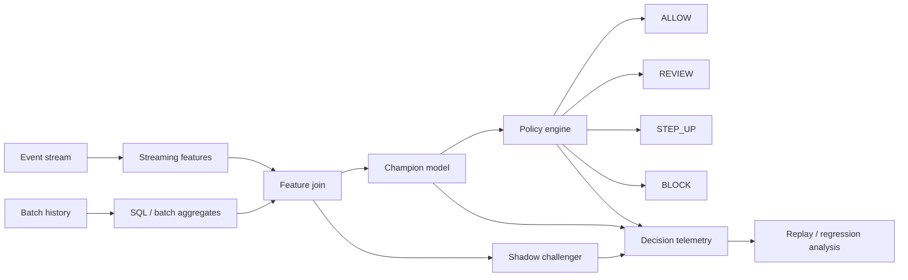

<div align="center">

# DecisionStream

### One decision surface. Two data speeds.

**Real-time + batch security decisioning reference platform**

`Streaming features` · `Batch aggregates` · `Policy actions` · `Shadow model` · `Replay` · `SQL`

</div>

<p align="center"></p>

---

## Product thesis

A production ML decision rarely depends on one model call. It depends on whether the system can combine **fresh behavioral signals** with **durable historical context**, score the event consistently, apply policy, record the outcome, and explain what happened later.

DecisionStream models that full decision point:

```text
Real-time event ─→ streaming features ─┐
                                       ├─→ feature join → ML score → policy → action
Historical data ─→ batch aggregates ──┘                         │
                                                                  ├→ telemetry
Shadow challenger ────────────────────────────────────────────────┘
                                                                  ↓
                                                                replay
```

It is intentionally more than `CSV → model → accuracy`.

---

## At a glance

| Layer | What DecisionStream demonstrates |
|---|---|
| **Streaming** | event-level behavioral velocity and low-latency signals |
| **Batch** | account history, prior-review rate, durable aggregates, SQL contract |
| **ML** | logistic champion + nonlinear challenger |
| **Policy** | `ALLOW`, `REVIEW`, `STEP_UP`, `BLOCK` |
| **Operations** | P50/P95 latency, action mix, decision cost, replayability |
| **Business** | expected synthetic loss, prevented synthetic loss, intervention efficiency |
| **Governance** | shadow-model disagreement and no automatic challenger promotion |

The dashboard now exposes **30+ ML, operational, policy, and business KPIs**.

---

## Example decision

Imagine a synthetic event arrives for a relatively new account:

```text
amount                $1,420
stream_velocity_10m   high
batch_velocity_24h    elevated
device_risk           elevated
device_account_fanout high
prior_review_rate     elevated
```

### Step 1 — join two time horizons

The streaming path contributes what happened **just now**. The batch path contributes what has happened **over time**.

### Step 2 — score with the champion

```text
Champion score:   0.71
Challenger score: 0.78
Shadow disagreement: 0.07
```

### Step 3 — apply policy

Default policy thresholds:

```text
score < 0.38        → ALLOW
0.38 – 0.64         → REVIEW
0.64 – 0.82         → STEP_UP
score ≥ 0.82        → BLOCK
```

A score of `0.71` becomes `STEP_UP`.

### Step 4 — write the decision log

The replay record captures:

```text
features + champion score + challenger score + action
+ latency + decision cost + synthetic outcome + prevented loss
```

That makes later regression testing possible without reconstructing the original decision from scattered logs.

---

## Architecture



---

## Dashboard

The Streamlit UI uses the same restrained Apple-inspired design language as the rest of the portfolio: large typography, white space, soft gray surfaces, rounded cards, subtle borders/shadows, system-style fonts, and concise operational storytelling.

### KPI families

**Model quality**
- champion PR-AUC / ROC-AUC
- precision / recall at intervention
- Brier calibration score
- challenger PR-AUC
- challenger lift
- mean / P95 shadow disagreement

**Policy health**
- allow / review / step-up / block rate
- intervention rate
- high-impact action rate
- false-positive rate at intervention
- false-negative rate
- top-decile event capture

**Operations**
- P50 / P95 decision latency
- average and P95 decision cost
- replay rows
- training / scoring rows
- feature-contract checks
- replay window

**Business / risk**
- current synthetic event rate
- adverse cases scored
- prevented synthetic loss
- prevented loss per intervention
- prevented loss per 1K scored events
- average event amount
- high-value event share

---

## Real-time vs batch features

### Streaming-style signals

```text
stream_velocity_10m
geo_velocity
device_risk
amount_log
```

These represent signals that would typically be derived close to the decision time.

### Batch-style signals

```text
batch_velocity_24h
prior_review_rate
device_account_fanout
account_age_signal
```

These represent durable historical context.

The local reference implementation computes both in pandas for reproducibility, while `sql/batch_features.sql` documents the batch-side aggregation contract.

---

## SQL reference

`sql/batch_features.sql` demonstrates windowed account history for:

- 24-hour event velocity
- prior review rate
- event/account join keys

The goal is not to pretend pandas is Spark. The goal is to keep a **portable feature contract** that could move into a distributed implementation while preserving the same replay/evaluation semantics.

---

## Champion / challenger behavior

The challenger scores every replay event but does **not** control the policy.

```text
Champion → production-style decision
Challenger → shadow score only
```

The dashboard highlights large disagreement cases so an engineer can ask:

- Is the challenger improving true positives?
- Is it changing calibration?
- Is it increasing review burden?
- Does its lift hold across policy bands?

Promotion should require replay evidence, not one better aggregate metric.

---

## Repository map

```text
.
├── app.py                     # Apple-inspired operations dashboard
├── engine.py                  # generator, features, scoring, policy, replay
├── sql/batch_features.sql     # batch feature contract
├── tests/test_engine.py
├── reports/evaluation.md
├── assets/dashboard-preview.svg
├── .streamlit/config.toml
├── .github/workflows/ci.yml
├── Dockerfile
└── requirements.txt
```

---

## Run locally

```bash
pip install -r requirements.txt
python engine.py --out artifacts
streamlit run app.py
```

Generated artifacts include the replay decision log and metrics JSON.

---

## What this project is demonstrating

DecisionStream is built to show end-to-end thinking across:

- Python ML pipelines
- SQL and batch feature computation
- streaming-style behavioral signals
- classification and calibration
- policy decisioning
- champion/challenger deployment patterns
- operational telemetry
- latency / cost measurement
- replay-based regression analysis
- robust system integration boundaries

---

## Responsible interpretation

The event stream, outcomes, latency, decision cost, and prevented-loss values are **synthetic**. Kafka/Spark-style concepts are represented as local reference patterns and are not claims of a live distributed deployment. The project does not connect to customer data or a real enforcement plane.

<div align="center">

### Join fast signals with durable context. Make the decision observable.

</div>
