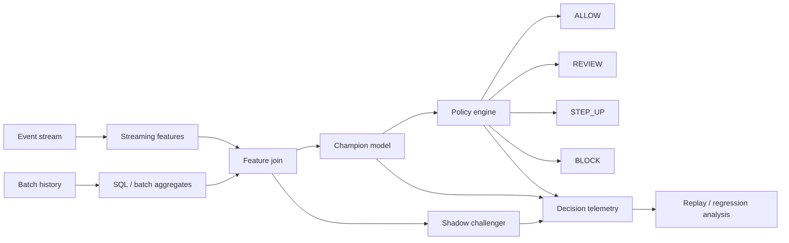

<div align="center">

# DecisionStream

### One decision surface. Two data speeds.

**Real-time + batch security decisioning reference platform**

`Streaming features` · `Batch aggregates` · `Policy actions` · `Shadow model` · `Replay` · `SQL`\n\n[](https://github.com/VinayK88/DecisionStream/actions/workflows/ci.yml) [](https://www.python.org/) [](LICENSE)

</div>

<p align="center"></p>

---

## Product thesis

A production ML decision rarely depends on one model call. It depends on whether the system can combine **fresh behavioral signals** with **durable historical context**, score the event consistently, apply policy, record the outcome, and explain what happened later.

DecisionStream models that full decision point:

```text
Real-time event ─→ streaming features ─┐
                                       ├─→ feature join → ML score → policy → action
Historical data ─→ batch aggregates ──┘                         │
                                                                  ├→ telemetry
Shadow challenger ────────────────────────────────────────────────┘
                                                                  ↓
                                                                replay
```

It is intentionally more than `CSV → model → accuracy`.

---

## At a glance

| Layer | What DecisionStream demonstrates |
|---|---|
| **Streaming** | event-level behavioral velocity and low-latency signals |
| **Batch** | account history, prior-review rate, durable aggregates, SQL contract |
| **ML** | logistic champion + nonlinear challenger |
| **Policy** | `ALLOW`, `REVIEW`, `STEP_UP`, `BLOCK` |
| **Operations** | P50/P95 latency, action mix, decision cost, replayability |
| **Business** | expected synthetic loss, prevented synthetic loss, intervention efficiency |
| **Governance** | shadow-model disagreement and no automatic challenger promotion |

The dashboard exposes **30+ ML, operational, policy, and business KPIs**.

---

## Example decision

Imagine a synthetic event arrives for a relatively new account:

```text
amount                $1,420
stream_velocity_10m   high
batch_velocity_24h    elevated
device_risk           elevated
device_account_fanout high
prior_review_rate     elevated
```

The streaming path contributes what happened **just now**. The batch path contributes what has happened **over time**. The champion and challenger score the same joined feature vector, the champion controls the policy action, and the decision log stores the features, both scores, action, latency, cost, and eventual synthetic outcome.

Default policy thresholds:

```text
score < 0.38        → ALLOW
0.38 – 0.64         → REVIEW
0.64 – 0.82         → STEP_UP
score ≥ 0.82        → BLOCK
```

---

## Architecture



---

## Dashboard

The Streamlit UI emphasizes operational evidence, policy trade-offs, champion/challenger behavior, and replay inspection.

The scorecard covers model quality, champion/challenger disagreement, allow/review/step-up/block mix, intervention rates, false-positive/false-negative behavior, latency, decision cost, replay size, feature-contract checks, synthetic event rate, prevented synthetic loss, high-value traffic, and business-risk efficiency.

---

## Temporal correctness

Features are calculated in event-time order using only information available at the decision timestamp. The 10-minute and 24-hour velocities are genuine prior-event windows, device fan-out is historical-only, and the train/test split is chronological. Tests verify that appending a future event cannot change earlier feature values.

---

## Real-time vs batch features

### Streaming-style signals

```text
stream_velocity_10m
geo_velocity
device_risk
amount_log
```

### Batch-style signals

```text
batch_velocity_24h
prior_review_rate
device_account_fanout
account_age_signal
```

The local reference implementation computes both in pandas for reproducibility, while `sql/batch_features.sql` documents the batch-side aggregation contract.

---

## Connecting DecisionStream to real data

DecisionStream is designed so the local synthetic generator can be replaced by an event bus plus a historical feature source without changing the core decision contract.

### Streaming input contract

```text
event_id            string
event_time          timestamp
entity/account_id   string
device_id           string optional
amount/value        numeric optional
stream features     numeric / categorical
```

### Batch feature contract

A warehouse or lakehouse query should produce one row per decision entity/event with durable features such as:

```text
account_id
batch_velocity_24h
prior_review_rate
device_account_fanout
account_age_signal
```

`sql/batch_features.sql` is the reference starting point for this layer.

### Practical integration options

| Layer | Production option |
|---|---|
| **Event ingestion** | Kafka, Azure Event Hubs, AWS Kinesis, Pub/Sub |
| **Batch/lakehouse** | Snowflake, Databricks, BigQuery, Spark, Delta Lake |
| **Feature serving** | Feast, Redis, warehouse-backed online tables, custom feature service |
| **Model serving** | FastAPI, Kubernetes service, managed inference endpoint |
| **Decision telemetry** | Kafka topic, warehouse fact table, OpenTelemetry/log pipeline |
| **Monitoring** | Streamlit for demo; Grafana, Power BI, Datadog, internal dashboards for production |

A production adapter would typically look like:

```text
Kafka / Event Hubs
      ↓
stream feature transform
      ↓
lookup durable features from feature store / warehouse
      ↓
normalize into FEATURES contract
      ↓
champion + shadow challenger
      ↓
policy engine
      ↓
decision log + outcome join
```

The current local code can also ingest a flat Parquet/CSV replay exported from a warehouse. The required mapping is straightforward: rename the organization-specific columns to the feature contract, preserve event time/order, and retain the ground-truth or reviewed outcome for evaluation.

### Example replay adapter

```python
import pandas as pd
from engine import train_and_score, policy, FEATURES

raw = pd.read_parquet("decision_replay.parquet").sort_values("event_time")
# Map your real columns into FEATURES before scoring.
train, scored = train_and_score(raw)
scored["decision"] = policy(scored["champion_score"])
```

For high-scale environments, pandas should be replaced by Spark/SQL/stream processing for feature computation, while keeping the same feature definitions, policy thresholds, and replay schema so offline and online decisions remain comparable.

---

## Practical significance

DecisionStream matters because a good model can still fail as a business system if its features are stale, joins are inconsistent, decisions are slow, policy thresholds are poorly chosen, or no replay evidence exists after an incident.

It gives engineering and business teams a common decision record that can answer:

- **What data was available at the exact decision time?**
- **Which streaming and historical signals influenced the score?**
- **What action did policy choose and why?**
- **How much latency and operational cost did that decision require?**
- **How often does the challenger disagree with the champion?**
- **Would a threshold change improve risk capture without overwhelming review capacity or adding customer friction?**
- **Can a release be replayed on historical decisions before promotion?**

For a fraud or security program, this can reduce the gap between experimentation and production decisioning. The practical outcome is not merely “higher AUC”; it is a system capable of making a timely action, measuring its downstream effect, comparing alternative configurations under the same replay, and explaining the tradeoff to engineering and business stakeholders.

---

## SQL reference

`sql/batch_features.sql` demonstrates windowed account history for 24-hour event velocity, prior review rate, and event/account join keys. The goal is to keep a **portable feature contract** that can move into a distributed implementation while preserving replay/evaluation semantics.

---

## Champion / challenger behavior

The challenger scores every replay event but does **not** control the policy.

```text
Champion → production-style decision
Challenger → shadow score only
```

Promotion should require replay evidence across predictive quality, calibration, policy mix, review burden, latency, and business outcomes rather than one better aggregate metric.

---

## Reproducible benchmark evidence

CI validates Python 3.10–3.12, executes the leakage-safe replay, and uploads the scored decisions, metrics, and manifest. The manifest records the feature contract and a deterministic SHA-256 over the decision replay.

See [the benchmark protocol](reports/benchmark-protocol.json) and [GitHub Actions](https://github.com/VinayK88/DecisionStream/actions).

---

## Repository map

```text
.
├── app.py
├── engine.py
├── sql/batch_features.sql
├── tests/test_engine.py
├── reports/evaluation.md
├── assets/dashboard-preview.svg
├── .streamlit/config.toml
├── .github/workflows/ci.yml
├── Dockerfile
└── requirements.txt
```

---

## Run locally

```bash
pip install -e '.[dev]'
python engine.py --out artifacts
streamlit run app.py
```

---

## What this project is demonstrating

DecisionStream shows end-to-end thinking across Python ML pipelines, SQL and batch feature computation, streaming-style behavioral signals, classification and calibration, policy decisioning, champion/challenger deployment patterns, operational telemetry, latency/cost measurement, replay-based regression analysis, and robust system-integration boundaries.

---

## Responsible interpretation

The event stream, outcomes, latency, decision cost, and prevented-loss values are **synthetic**. Kafka/Spark-style concepts are represented as local reference patterns and are not claims of a live distributed deployment. The project does not connect to customer data or a real enforcement plane.

<div align="center">

### Join fast signals with durable context. Make the decision observable.

</div>
