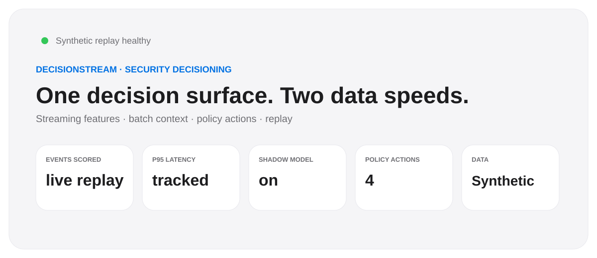
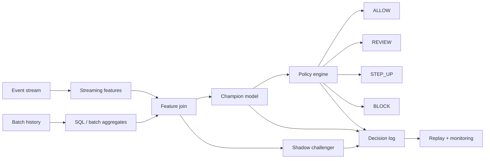

# DecisionStream

**Real-time + batch security decisioning reference platform.**

<p align="center"></p>

DecisionStream focuses on a gap between model development and operational decisioning: **how streaming behavior, batch context, model scores, policy actions, shadow evaluation, latency, and cost fit together at one decision point.**

It is designed around the Apple SDS requirement to collaborate across data engineering and platform architecture on robust **real-time and batch decisioning** while preserving a clean evaluation/replay surface useful for security engineering.

## What it demonstrates

- Deterministic synthetic event stream with account/device behavior
- Streaming-style velocity signals and batch aggregate features
- Time-ordered champion model training and a shadow challenger
- Policy actions: `ALLOW`, `REVIEW`, `STEP_UP`, `BLOCK`
- Decision latency, decision-cost, expected-loss, and shadow-disagreement telemetry
- Replayable event log for regression analysis
- SQL reference for batch feature computation
- Apple-inspired Streamlit dashboard with 20 KPIs
- Tests, CLI, Docker, and CI

## Architecture



## SQL reference

`sql/batch_features.sql` shows the batch-side aggregation contract for 24-hour account velocity and prior-review history. The local demo computes equivalent features with pandas so it remains easy to run without a distributed cluster.

## Run

```bash
pip install -r requirements.txt
python engine.py --out artifacts
streamlit run app.py
```

## Repository map

```text
.
├── app.py
├── engine.py
├── sql/batch_features.sql
├── tests/test_engine.py
├── reports/evaluation.md
├── assets/dashboard-preview.svg
├── .streamlit/config.toml
├── .github/workflows/ci.yml
├── Dockerfile
└── requirements.txt
```

## Responsible interpretation

The event stream, operational latency, prevented-loss values, and outcomes are synthetic. The project demonstrates system design and measurement patterns; it does not claim production integrations or real fraud/security performance.

---
**Join fast signals with durable context. Make the decision observable.**
